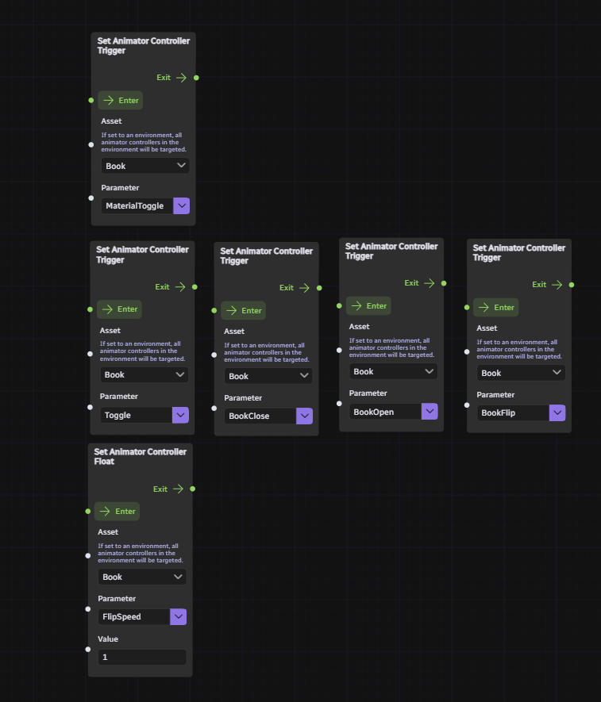
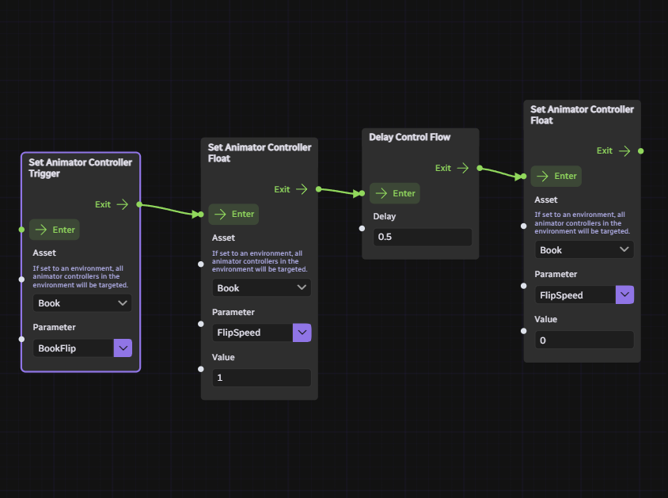
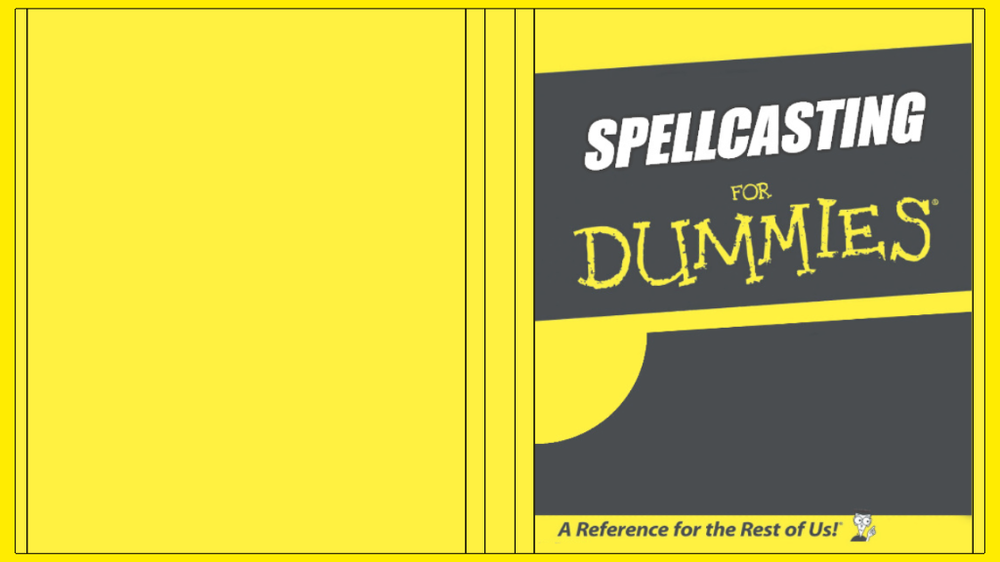

## Animating the book/change state of the book
Trigger Animator Controller of the prop. Each trigger will do the following:
- BookClose - Close the book
- BookOpen - Open the book
- BookFlip - Continously flip a page of the book
- Toggle - Cycle between BookOpen -> BookClose -> BookFlip animations
- MaterialToggle - Fade in and out the book

You can also adjust float parameters of the Controller
- FlipSpeed - Change page flipping speed of the book

## Flip only one page
Create a blueprint like the one below, and enter the leftmost node.

## Change texture of the cover
You can change texture of the book by setting Override texture(s) to the following properties. 

Save the UV below to use it as a reference for creating your own texture:

Below is a reference default texture with UV overlay

